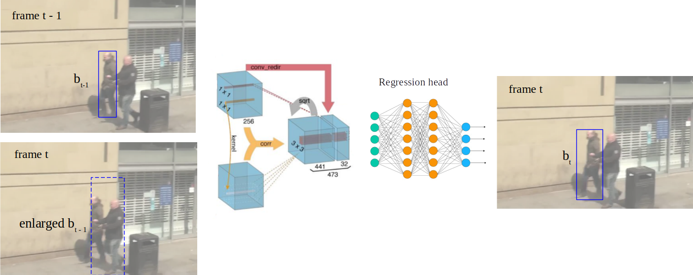
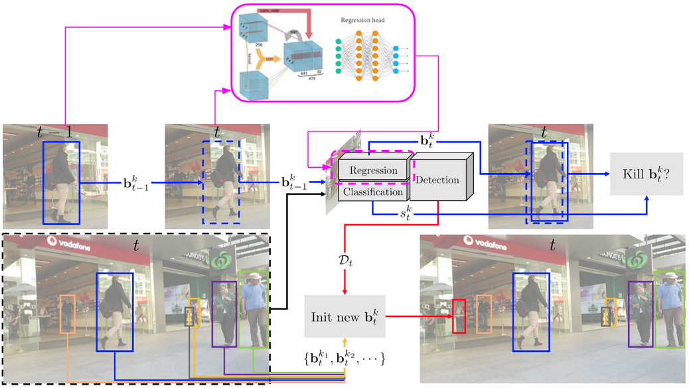
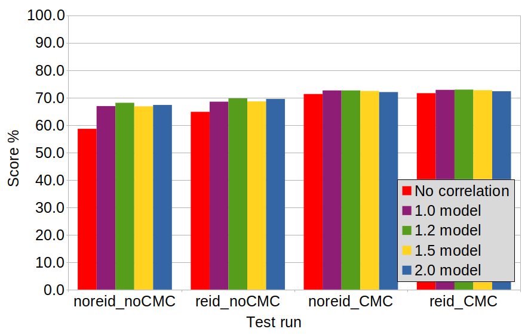
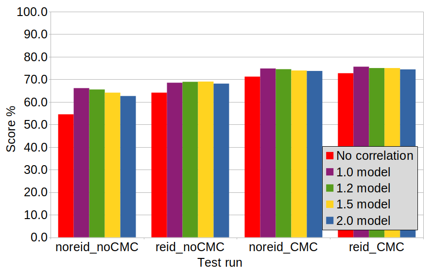
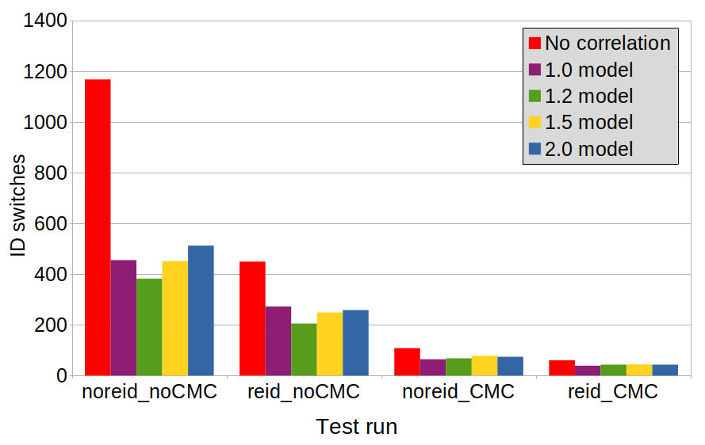

# Extending Tracktor++ with Correlation Motion Model
This is en extension of [Tracktor++](https://git.io/fjQr8) of the paper ["Tracking without bells and whistles"](https://arxiv.org/pdf/1903.05625.pdf), a multiple-object tracker that uses object detectors for tracking. Our extension adds a correlation motion model to correlate the feature patches of two frames. [Here](https://youtu.be/NQQlPNUhIrY) is a video about our project.

## Motivation
 Bergmann, Meinhardt and Leal-Taixé assume little displacement of a person from frame to frame, which is not the case for:

- Large camera motion and low video frame rates: if the displacement of the object between frames is too large, it will completely leave the bounding box of the previous frame, thus the trajectory will be broken.
- Crowdedness: several objects are present within one bounding box and the Tracktor is unable to transfer the identity of the object to a previous bounding box. 
## Approach
**Box Enlargement:**
To solve the first challenge we modified the code to enlarge the bounding box of the previous frame before the regression to increase the probability that the object of the current frame remains inside the (now enlarged) bounding box of the previous step. 

**Correlation Head:**
The box enlargement however increases the chances of crowdedness and the object detector regression head might not be able to regress the box to the correct person. To remedy this problem, we implemented the correlation head, an extra regression head that will correlate the feature patches of the previous and current frame using the previous bounding box and the enlarged one respectively. This correlation head uses a correlation layer with its Siamese architecture that performs multiplicative patch comparisons between two feature maps.

The pink arrows and box show how our extensions adds to Tracktor++.


## Experiments
### Dataset
MOT17 and MOT20 sequences were used to extract pairs of feature patches of the same track from consecutive frames in order to create a dataset for the correlation head training. Given that we use the enlarged box to extract the feature patch of the current frame, several datasets were created with different enlargement factors.
### Training
We trained 4 different correlation head models in order to evaluate the impact of the enlargement on the regression. The enlargement factors used were: 1.0, 1.2, 1.5 and 2.0.
### Ablation Study
Tracktor++ uses two extensions to improve its performance over Tracktor: a reID Siamese network, used to re-identify a person that was occluded for a short period of time and a camera motion compensation (CMC) algorithm to shift the bounding boxes before the regression in case of camera motion.

 Our hypothesis is that the correlation head combined with the box enlargement will outperform Tracktor++ without making use of the CMC. To validate the hypothesis the tests were conducted by combining the use of these extensions and the correlation head to evaluate its impact on Tracktor.

Sequence 13 of the MOT17 Challenge was used as a validation dataset for all the experiments conducted,  it includes large camera motion, thus we chose it to evaluate how well the model is generalizing.

## Results
Performance measured on the test set of the [MOT17 Challenge](https://motchallenge.net/results/MOT17/).
|Model | MOTA &#8593;| IDF1 &#8593;| IDs|
|:---|---|---|---|
|TracktorCorr | **56.3** | **55.4** | 2034|
|Tracktor++v2 | **56.3** | 55.1 |**1987**|
|Tracktor++ | 53.5 |52.3 | 2072|

### Results Ablation Study on Sequence 13

| MOTA &#8593;| IDF1 &#8593;| IDs|
|:---|---|---|
||||

## Installation, Dataset, Training, Evaluation
Will be added later. (Also removing Colab dependencies).

## Acknowledgements and References
Our code is developed based on [Tracktor++](https://git.io/fjQr8) and uses the [Pytorch Correlation module](https://github.com/ClementPinard/Pytorch-Correlation-extension). We thank Tim Meinhardt for the idea for this project and helpful feedback. The following works were used as references:

```
  @InProceedings{paper_tracktor_2019_ICCV,
  author = {Bergmann, Philipp and Meinhardt, Tim and Leal{-}Taix{\'{e}}, Laura},
  title = {Tracking Without Bells and Whistles},
  booktitle = {The IEEE International Conference on Computer Vision (ICCV)},
  month = {October},
  year = {2019}
  }

  @article{paper_flownet,
  author    = {Philipp Fischer and Alexey Dosovitskiy and Eddy Ilg and
               Philip H{\"{a}}usser and Caner Hazirbas and Vladimir Golkov and
               Patrick van der Smagt and Daniel Cremers and Thomas Brox},
  title     = {FlowNet: Learning Optical Flow with Convolutional Networks},
  journal   = {CoRR},
  volume    = {abs/1504.06852},
  year      = {2015},
  url       = {http://arxiv.org/abs/1504.06852}
}

@article{paper_mot16,
  author    = {Anton Milan and Laura Leal{-}Taix{\'{e}} and
               Ian D. Reid and Stefan Roth and Konrad Schindler},
  title     = {{MOT16:} {A} Benchmark for Multi-Object Tracking},
  journal   = {CoRR},
  volume    = {abs/1603.00831},
  year      = {2016},
  url       = {http://arxiv.org/abs/1603.00831}
}
```